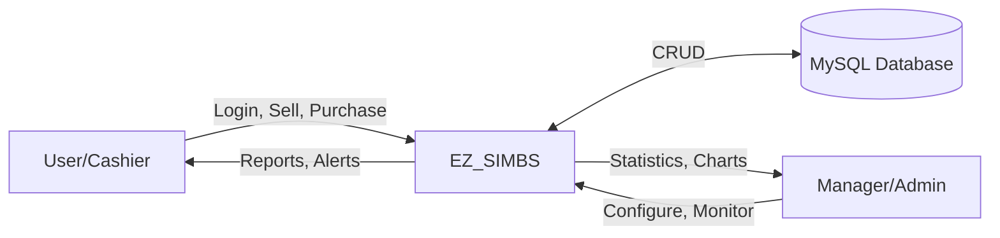
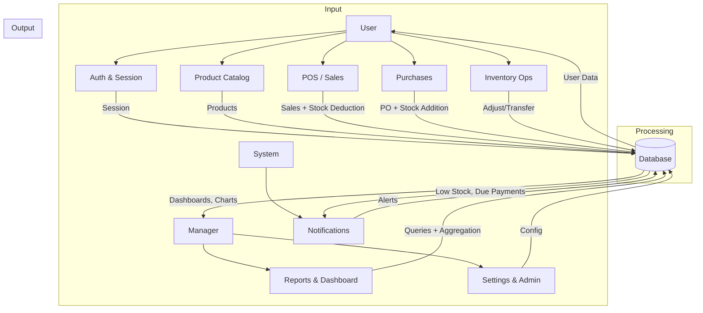
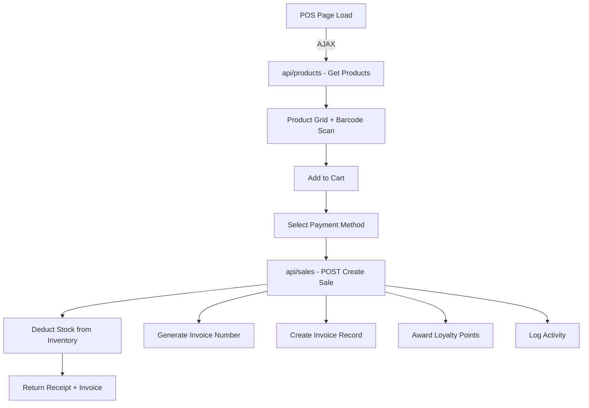
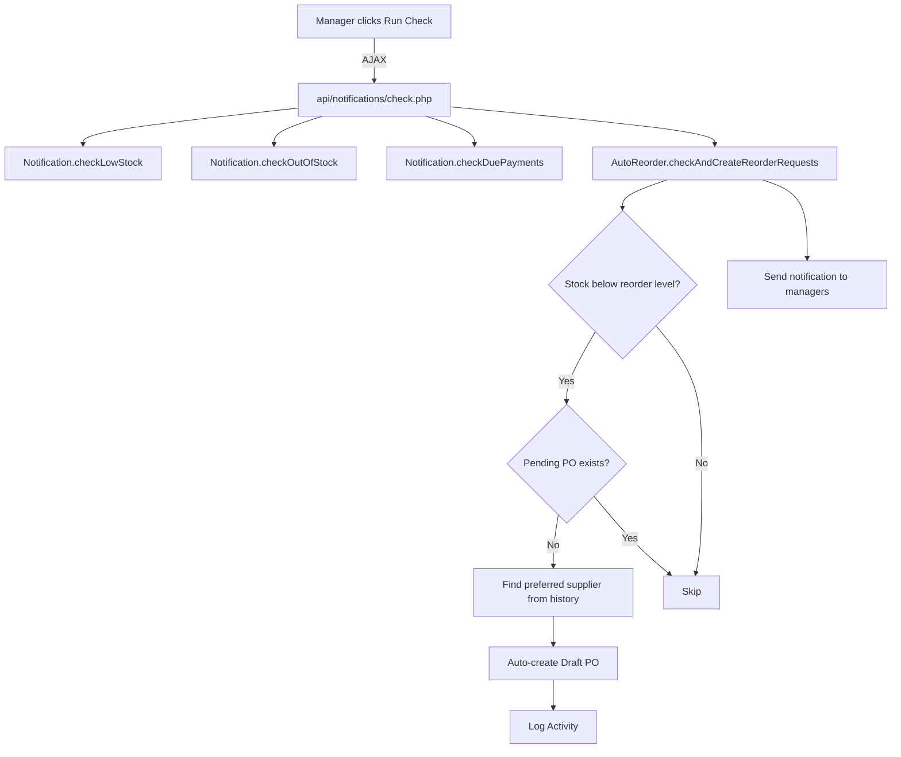

# EZ_SIMBS - Data Flow Diagram

> Render this with any Mermaid-compatible tool

## Level 0 - Context Diagram

## Level 1 - Major Processes

## Level 2 - Sales Flow

## Level 2 - Auto-Reorder Flow

