# EZ_SIMBS - Use Case Diagram

> Render this with any Mermaid-compatible tool

```mermaid
graph TB
    Admin((Admin))
    Manager((Manager))
    BranchMgr((Branch Manager))
    Cashier((Cashier))
    Customer((Customer))

    subgraph Authentication
        UC1[Login]
        UC2[Logout]
        UC3[Register Account]
        UC4[Change Password]
    end

    subgraph Product Management
        UC5[Manage Categories]
        UC6[Manage Brands]
        UC7[Manage Units]
        UC8[Manage Products]
        UC9[Upload Product Image]
        UC10[Scan Barcode]
    end

    subgraph Inventory
        UC11[View Stock Levels]
        UC12[Stock In/Out]
        UC13[Adjust Stock]
        UC14[Record Damage]
        UC15[Transfer Stock]
        UC16[View Stock Logs]
    end

    subgraph Sales
        UC17[Open POS]
        UC18[Add to Cart]
        UC19[Apply Discount]
        UC20[Process Payment]
        UC21[Hold/Resume Sale]
        UC22[Cancel Sale]
        UC23[Process Return]
        UC24[Print Receipt]
        UC25[View Invoices]
    end

    subgraph Purchases
        UC26[Create Purchase Order]
        UC27[Approve PO]
        UC28[Receive Stock]
        UC29[Make Payment]
        UC30[Cancel PO]
    end

    subgraph People
        UC31[Manage Suppliers]
        UC32[Manage Customers]
        UC33[Manage Users]
        UC34[Manage Branches]
    end

    subgraph Intelligence
        UC35[View Dashboard]
        UC36[View Reports]
        UC37[Export CSV]
        UC38[View Notifications]
        UC39[Run Auto-Reorder]
        UC40[View Reorder Suggestions]
    end

    subgraph System
        UC41[Configure Settings]
        UC42[Backup Database]
        UC43[Restore Database]
        UC44[View Activity Log]
        UC45[Toggle Theme]
    end

    Admin --> UC1 & UC2 & UC3 & UC4
    Admin --> UC5 & UC6 & UC7 & UC8 & UC9 & UC10
    Admin --> UC11 & UC12 & UC13 & UC14 & UC15 & UC16
    Admin --> UC17 & UC18 & UC19 & UC20 & UC21 & UC22 & UC23 & UC24 & UC25
    Admin --> UC26 & UC27 & UC28 & UC29 & UC30
    Admin --> UC31 & UC32 & UC33 & UC34
    Admin --> UC35 & UC36 & UC37 & UC38 & UC39 & UC40
    Admin --> UC41 & UC42 & UC43 & UC44 & UC45

    Manager --> UC1 & UC2
    Manager --> UC8 & UC10 & UC11 & UC12 & UC13 & UC14 & UC15 & UC16
    Manager --> UC17 & UC18 & UC19 & UC20 & UC21 & UC22 & UC23 & UC24 & UC25
    Manager --> UC26 & UC27 & UC28 & UC29 & UC30
    Manager --> UC31 & UC32 & UC34
    Manager --> UC35 & UC36 & UC37 & UC38 & UC39 & UC40

    BranchMgr --> UC1 & UC2
    BranchMgr --> UC11 & UC12 & UC13 & UC15 & UC16
    BranchMgr --> UC17 & UC18 & UC19 & UC20 & UC21 & UC23 & UC24

    Cashier --> UC1 & UC2
    Cashier --> UC10 & UC11
    Cashier --> UC17 & UC18 & UC19 & UC20 & UC23 & UC24 & UC25
    Cashier --> UC32

    Customer --> UC3 & UC25
```

## Actor Descriptions

| Actor | Description |
|-------|------------|
| Admin | Full system access. Manages all modules, settings, users, branches, and database |
| Manager | Manages inventory, sales, purchases, reports. Can view all branches |
| Branch Manager | Manages assigned branch's inventory and sales. Limited to own branch |
| Cashier | Processes sales via POS. Views products and stock levels |
| Customer | Self-registers, views own invoices |
